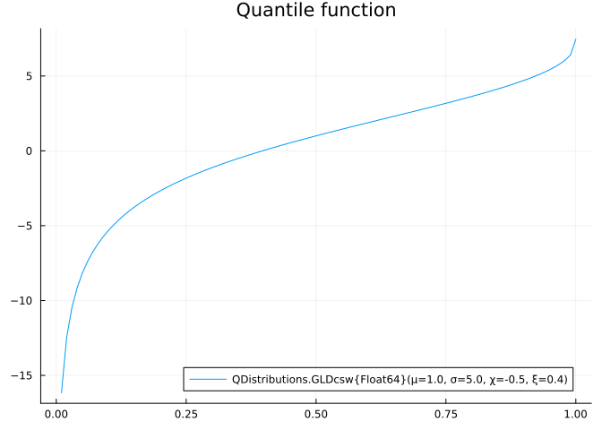
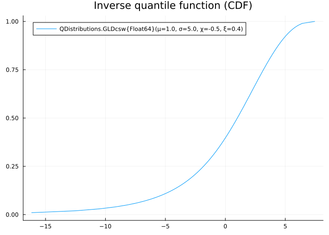
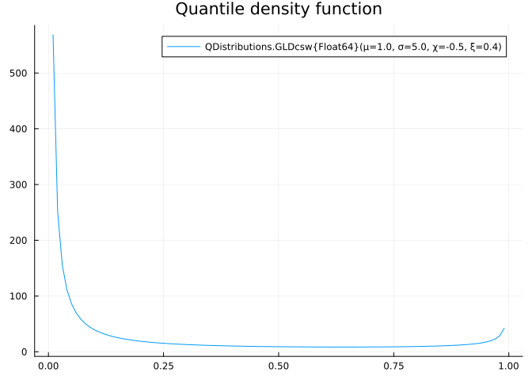

# QDistributions.jl

A Julia package for (continuous) quantile distributions and associated
functions. Particularly QDistributions implements:

- Quantile function (`quantile`) and complimentary (non-increasing)
  quantile function (`cquantile`).
- Quantile-based statistics: median (`median`), inter-quartile range
  (`iqr`), robust (Galton-Bowley) skewness (`rskewness`), robust
  (Moors’) kurtosis (`rkurtosis`).
- Quantile density function (`qdf`), density quantile function (`dqf`)
  and its logarithm (`logdqf`).
- Inverse of quantile function (`cdf`): close-form, where available, or
  approximated by a bracketed rootfinder, otherwise. Complimentary CDF
  (survival function) `ccdf`
- Probability density function (`pdf`), as a thin wrapper over `dqf` and
  `cdf`; also `logpdf`.
- Sampling from a distribution (`rand` and `sampler` functions)

Where possible, the following functions are also implemented:

- Pearson moments: `mean`, `var`, `skewness`, `kurtosis`
- L-moments: `lmoment`
- L-coefficient of variance (`lvar`), L-skewness ratio (`lskewness`),
  L-kurtosis ratio (`lkurtosis`).

## Generalized Lambda Distribution (CSW parameterization)

Generalilzed Lambda Distribution reparameterized by Chalabi, Scott, and
Wuertz (2012) (GLD CSW) is a flexible quantile-based distribution with
two shape parameters: asymmetry $\chi$ and steepness $\xi$. Besides, it
is an IQR-scaled distribution, meaning that its scale parameter $\sigma$
corresponds to the inter-quartile range (IQR).

## Flattened Skew-Logistic Distribution (FSLD)

One of the most iconic, yet simple quantile-based distributions
introduced by Chakrabarty and Sharma (2018) and Chakrabarty and Sharma
(2021), combining ideas presented in Gilchrist (2000).

``` julia
using QDistributions, Plots
p_grd = 0:0.01:1

dl = FGLD(1, 5, 0.2, 3)

q_grd = quantile(dl, p_grd)
f_grd = map(Base.Fix1(qdf,dl), p_grd)
dq_grd = map(Base.Fix1(dqf,dl), p_grd)

plot(p_grd, q_grd, title="Quantile function", label=string(dl))
```


``` julia

p_grd_aprx = cdf(dl, q_grd)

plot(q_grd, p_grd_aprx, title="Inverse quantile function (CDF)", label=string(dl))
```



``` julia

plot(p_grd, f_grd, title="Quantile density function", label=string(dl))
```



``` julia

plot(q_grd, dq_grd, title="Density Quantile Function", label=string(dl))
```



## Contributing

## Citing

## References

<div id="refs" class="references csl-bib-body hanging-indent"
entry-spacing="0">

<div id="ref-chakrabarty2018QuantileBasedSkewLogistic"
class="csl-entry">

Chakrabarty, Tapan Kumar, and Dreamlee Sharma. 2018. “The Quantile-Based
Skew Logistic Distribution with Applications.” In *Statistics and Its
Applications*, edited by Asis Kumar Chattopadhyay and Gaurangadeb
Chattopadhyay, 51–73. Springer Proceedings in Mathematics & Statistics.
Singapore: Springer. <https://doi.org/10.1007/978-981-13-1223-6_6>.

</div>

<div id="ref-chakrabarty2021GeneralizationQuantileBasedFlattened"
class="csl-entry">

———. 2021. “A Generalization of the Quantile-Based Flattened Logistic
Distribution.” *Annals of Data Science* 8 (3): 603–27.
<https://doi.org/10.1007/s40745-021-00322-3>.

</div>

<div id="ref-chalabi2012FlexibleDistributionModeling" class="csl-entry">

Chalabi, Yohan, David J Scott, and Diethelm Wuertz. 2012. “Flexible
Distribution Modeling with the Generalized Lambda Distribution.” Working
paper MPRA Paper No. 43333,. Zurich, Switzerland: ETH.
<https://mpra.ub.uni-muenchen.de/43333/>.

</div>

<div id="ref-gilchrist2000StatisticalModellingQuantile"
class="csl-entry">

Gilchrist, Warren. 2000. *Statistical Modelling with Quantile
Functions*. Boca Raton: Chapman & Hall/CRC.
<https://doi.org/10.1201/9781420035919>.

</div>

</div>
